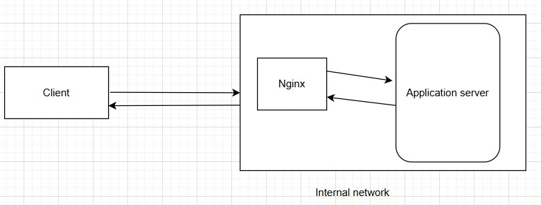

JS

# 001

## Features :

reverse proxy

load balancer

web-application firewall

cachy

# Installations

## on Amazon Linux

a  yum install nginx
    b  systemctl enable nginx
    c  systemctl status nginx
    d  systemctl start nginx
   e  systemctl status nginx

[root@ip-172-31-24-112 ~]# yum install nginx

Last metadata expiration

check: 0:03:04 ago on Fri Oct 25 17:46:21 2024.Dependencies resolved.Package

Arch     Version                     Repository     Size

Installing:
 nginx                 x86_64   1:1.24.0-1.amzn2023.0.4     amazonlinux    33 k
Installing dependencies:
 generic-logos-httpd   noarch   18.0.0-12.amzn2023.0.3      amazonlinux    19 k
 gperftools-libs       x86_64   2.9.1-1.amzn2023.0.3        amazonlinux   308 k
 libunwind             x86_64   1.4.0-5.amzn2023.0.2        amazonlinux    66 k
 nginx-core            x86_64   1:1.24.0-1.amzn2023.0.4     amazonlinux   586 k
 nginx-filesystem      noarch   1:1.24.0-1.amzn2023.0.4     amazonlinux   9.8 k
 nginx-mimetypes       noarch   2.1.49-3.amzn2023.0.3       amazonlinux    21 k

## Rhl - rocky linux

a. apt-get update
b. apt-get install nginx
c. Verify the version.
root@workernode1:~# /usr/sbin/nginx -v
nginx version: nginx/1.18.0 (Ubuntu)
d.
apt install net-tools
e.
Document - Install Nginx
Approach 1:

yum install nginx
systemctl start nginx
systemctl enable nginx
nginx -V
Approach 2 (Recommended):

### Download and install

https://www.nginx.com/resources/wiki/start/topics/tutorials/install/

yum -y install wget
wget https://nginx.org/packages/centos/8/x86_64/RPMS/nginx-1.20.1-1.el8.ngx.x86_64.rpm
yum install nginx-1.20.1-1.el8.ngx.x86_64.rpm
systemctl start nginx
systemctl enable nginx
nginx -V

## Protocols

FTP : File transfer protocol

DNS : Domain name system protocal

TCP : Transmission control protocal

SFTP : secure file transfer protocol

HTTP : Hyper text transfer protocol

IP : Internet protocl

## curl

1. curl dexter.kplabs.in/partial.txt
2. curl with response header

C:\Users\sanemu>curl -I dexter.kplabs.in/partial.txt
HTTP/1.1 200 OK

3. curl with partial data :

   C:\Users\sanemu>curl --header "Range: bytes=0-20" dexter.kplabs.in/partial.txt
   1
   2
4. trace - command : curl -X "TRACE" dexter.kplabs.in/partial.txt

   C:\Users\sanemu>curl -X "TRACE" dexter.kplabs.in/partial.txt

   5. http head : curl -X "OPTIONS" http://`<ip address> -i `

# Codes

## HTTP Request Methods

GET- to retrieve data from the server

POST-send input data to the server

HEAD-exactly like GET, but server only responds with headers

PUT-write documents to the server

DELETE-deletes resource from the server

OPTIONS-assks server on which methods it supports

TRACE-ECHOS the receive request from the Web server

## HTTP Respose status code

100 to 199 - informational status codes

200 to 299 - success status codes

300-399 - redirection status codes

400-499 : client error status codes

500-599 : server error status codes

# Getting started with Nginx

## Contexts

main, events, http, mail

# Reverse proxy

is type of proxy server which retreves resourcs on behalf of a client from one or more servers

it hides the existence of the original backend servers

can protect the back-end servers from web-based attacks, DOS attac

can provide great caching functionality

can optimize the content by compressing it

can act as a SSL termination proxy

request routing and many more

## Implementation

using proxy_pass directive

### step 1

 server detals

3 servers :

a. Nginxproxy (reverse proxy)

b. Application

c. Authentication

### step 2

install nginx on all 3 servers

### step 3

Update index.html with assoicated text as below

I am proxy server, I am application server and I am authentication server.

For auth server : create an admin dir and html under this dir. Verify with http://18.219.83.193/admin/

#### config of reverse proxy : add below lines under server tag :

    location / {
        proxy_pass http://172.31.16.42;   #application server
    }

    location /admin {
        proxy_pass http://172.31.31.68;  #authentication server
      }

### step 4 : testing

http://`<reverse proxy ip> --> it will hit application server`

http://`<reverse proxy ip> /admin/ --> it will hit Authentication server `

#### Doc from course

Document - Reverse Proxy Setup

**Step 1: Launch 3 Servers**

1st - Nginx Reverse Proxy

2nd - Application Server

3rd - Authentication Server

**Step 2: Install Nginx using RPM Method**

<pre class="prettyprint linenums prettyprinted" role="presentation"><ol class="linenums"><li class="L0">
yum -y install wget
</li><li class="L1" data-node-id="20241026171516-ckbiqif">
wget https://nginx.org/packages/centos/8/x86_64/RPMS/nginx-1.20.1-1.el8.ngx.x86_64.rpm
</li><li class="L2">
yum -y install nginx-1.20.1-1.el8.ngx.x86_64.rpm
</li><li class="L3" data-node-id="20241026171516-iol43n0">
systemctl start nginx
</li></ol></pre>

**Step 3: Installing net-tools**

<pre class="prettyprint linenums prettyprinted" role="presentation"><ol class="linenums"><li class="L0">
yum -y install net-tools
</li><li class="L1" data-node-id="20241026171516-bukzutf">
ifconfig
</li></ol></pre>

**Step 4: Adding contents to html file**

Admin Server:

<pre class="prettyprint linenums prettyprinted" role="presentation"><ol class="linenums"><li class="L0">
cd /usr/share/nginx/html
</li><li class="L1" data-node-id="20241026171516-ttgrvvs">
echo "This is application server backend"> index.html
</li></ol></pre>

Auth Server:

<pre class="prettyprint linenums prettyprinted" role="presentation"><ol class="linenums"><li class="L0">
cd /usr/share/nginx/html
</li><li class="L1" data-node-id="20241026171516-gup08e6">
mkdir admin
</li><li class="L2">
echo "This is auth server file under admin"> index.html
</li></ol></pre>

**Disable SELinux:**

<pre class="prettyprint linenums prettyprinted" role="presentation"><ol class="linenums"><li class="L0">
getenforce
</li><li class="L1" data-node-id="20241026171516-2q0r2t4">
setenforce 0
</li></ol></pre>

**Final Configuration:**

<pre class="prettyprint linenums prettyprinted" role="presentation"><ol class="linenums"><li class="L0">
cd /etc/nginx/conf.d
</li><li class="L1" data-node-id="20241026171516-38lhdjt">
nano proxy.conf
</li></ol></pre>

<pre class="prettyprint linenums prettyprinted" role="presentation"><ol class="linenums"><li class="L0">
server {
</li><li class="L1" data-node-id="20241026171516-331ebpd">
    listen       80;
</li><li class="L2">
    server_name  localhost;
</li><li class="L3" data-node-id="20241026171516-nfu3h4s">
 
</li><li class="L4">
    location /{
</li><li class="L5" data-node-id="20241026171516-w3orld8">
        proxy_pass http://10.139.0.3;
</li><li class="L6">
}
</li><li class="L7" data-node-id="20241026171516-9q055jp">
 
</li><li class="L8">
    location /admin {
</li><li class="L9" data-node-id="20241026171516-j1h2g9a">
        proxy_pass http://139.59.11.125;
</li><li class="L0">
}
</li><li class="L1" data-node-id="20241026171516-ed1f6qe">
}
</li></ol></pre>

<pre class="prettyprint linenums prettyprinted" role="presentation"><ol class="linenums"><li class="L0">
nginx -t
</li><li class="L1" data-node-id="20241026171516-myx6xng">
systemctl restart nginx
</li></ol></pre>

## X-Real-Ip

Architecture : Web browser -> Nginx -> Webserver (backend server)

This way client ip will be logged in at the backend server.

by defualt, client ip will not be logged in at the backend server.

we need to add additional params at below of proxy_pass, it will promote ip addres at logs.

### Document - X-Real-IP Configuration

**Reverse Proxy Side (proxy server))**

`nano /etc/nginx/conf.d/proxy.conf`

`proxy_set_header X-Real-IP $remote_addr;`

**Backend Server Side (Application server)**

`nano /etc/nginx/nginx.conf`

`"$http_x_real_ip"`

## Proxy Host Header

By default header details will not send, it can be achive by this way

### Document - Proxy Host Header Commands

**Reverse Proxy Level**

`proxy_set_header Host $host`

**Backend Server Level**

<pre class="prettyprint linenums prettyprinted" role="presentation"><ol class="linenums"><li class="L0">
yum -y install tcpdump
</li><li class="L1" data-node-id="20241026172828-m62qt8v">
tcpdump -A -vvvv -s 9999-i eth1 port 80>/tmp/headers
</li></ol></pre>

Document - Proxy Host Header Commands

**Reverse Proxy Level**

`proxy_set_header Host $host`

**Backend Server Level**

<pre class="prettyprint linenums prettyprinted" role="presentation"><ol class="linenums"><li class="L0">
yum -y install tcpdump
</li><li class="L1" data-node-id="20241026172830-7ctqirf">
tcpdump -A -vvvv -s 9999-i eth1 port 80>/tmp/headers
</li></ol></pre>

# Load balancer

## Configuration

Below configuarion should be done at the proxy server.

upstream backend {
  server 10.139.0.3; #endpoint 1
  server 10.139.0.4; #endpoint 2
}

server {
    listen       80;
    server_name  localhost;

    location / {
        proxy_pass http://backend; #Here backend needs to be configure
 }
}

## Health check params

### a. max_fails

sets the number of failed attempts that must occur during the fail_timeout period for the server to be marked unavailable

### b. fail_timeout

sets the time during which a number of failed attempts must happen for the server to be marked unavailable, and also the time for which the server is marked unavailble

upstream backend {
  server 10.139.0.3 max_fails=2 fail_timeout=30s;
  server 10.139.0.4 max_fails=2 fail_timeout=30s;
}

## Based on weight-un equal traffic

upstream backend {
  server 10.139.0.3 weight=2;
  server 10.139.0.4;
}

## Least connect Algorithm

Connection will goes to non busy server.

upstream backend {

   least_conn: #it takes lease_connect algo instead of RR
  server 10.139.0.3;
  server 10.139.0.4;
}

# Caching subsystem

Client<-> Cache server(DB) <-> App server (backend server)

requests can be manage by Cache server it has data.

Cache server -> can be a dedicated server or browser can be manage.

## Uses

it reduces the overhead of server's resources

decreases the network bandwidth

Pages are loaded much more faster

### Cache Control Header

Banking, Finance, Share market - we should not maintain cache.

do not store any kind of cache at all

store the cache, but verify with webserver whether file is modified

store the cache for 24 hours.

Example : Cache-Control of google.co.in

C:\Users\sanemu>curl -I http://google.co.in
HTTP/1.1 301 Moved Permanently
Location: http://www.google.co.in/
Content-Type: text/html; charset=UTF-8
Content-Security-Policy-Report-Only: object-src 'none';base-uri 'self';script-src 'nonce-DRSP2omaFpcVLcDQWgEqLg' 'strict-dynamic' 'report-sample' 'unsafe-eval' 'unsafe-inline' https: http:;report-uri https://csp.withgoogle.com/csp/gws/other-hp
Date: Sun, 27 Oct 2024 09:28:36 GMT
Expires: Tue, 26 Nov 2024 09:28:36 GMT
Cache-Control: public, max-age=2592000
Server: gws
Content-Length: 221
X-XSS-Protection: 0
X-Frame-Options: SAMEORIGIN

#### cache-control Header

no-store, no-cache, must-revalidate, public, private

Cache-Contro : no-store, no-cache, max-age=0, s-maxage=0, must-revalidate, no-cache

Pragma : no-cache

##### actual syntax : it should be added at server tag :

add_header Cache-Control no-store;
