JS

# Link :

https://gitlab.com/twn-youtube/nginx-crash-course
https://www.youtube.com/watch?v=q8OleYuqntY&list=WL&index=16&t=2954s
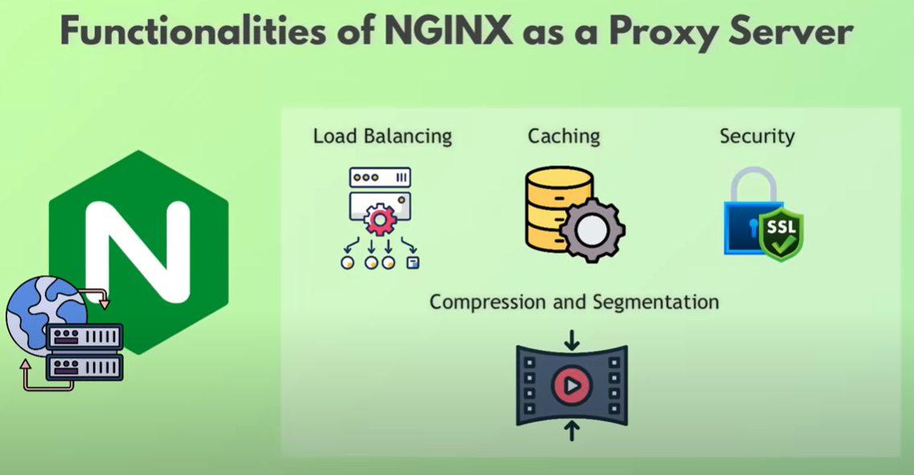

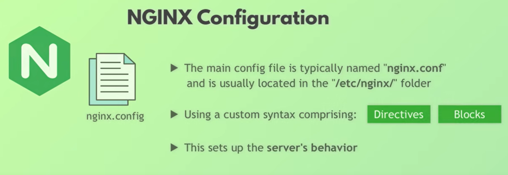

# Nginx as Web Server

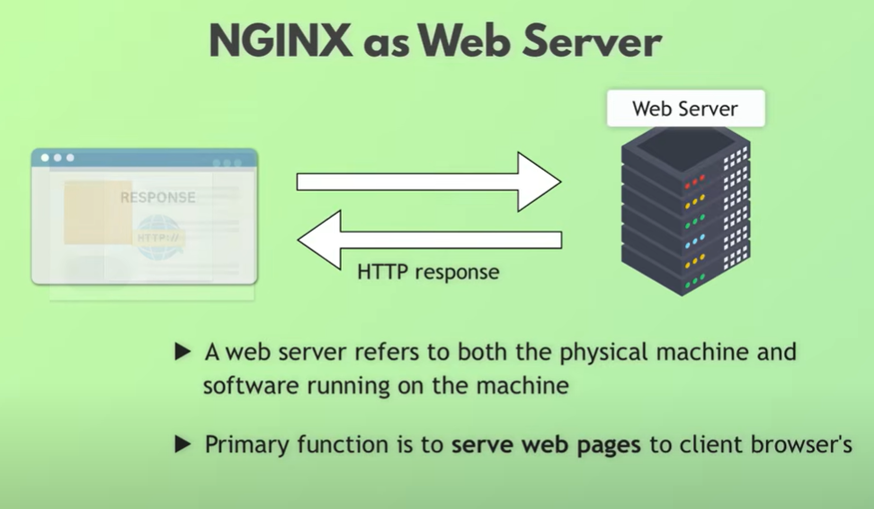

# Nginx as Load Balancer
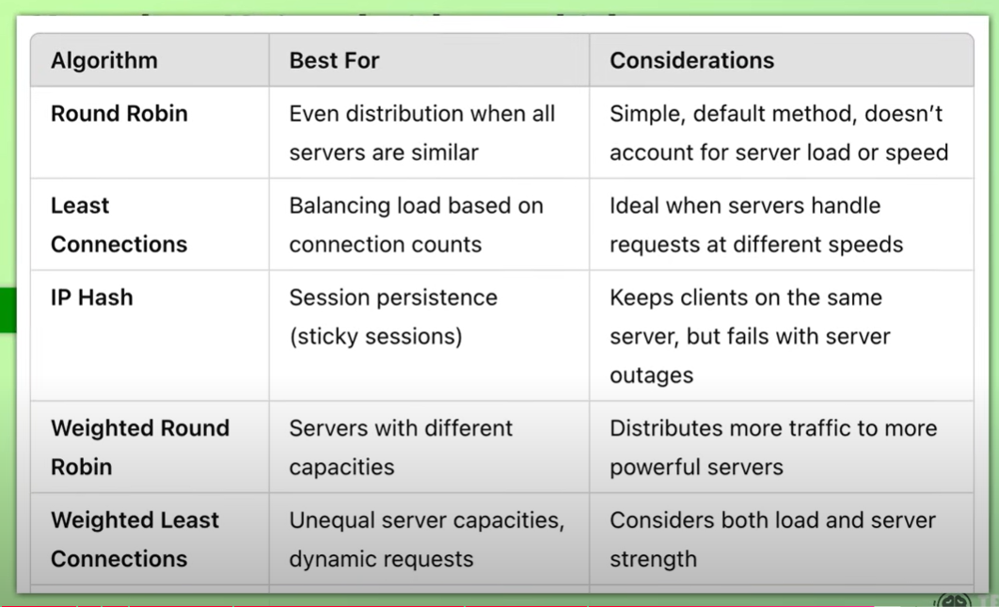
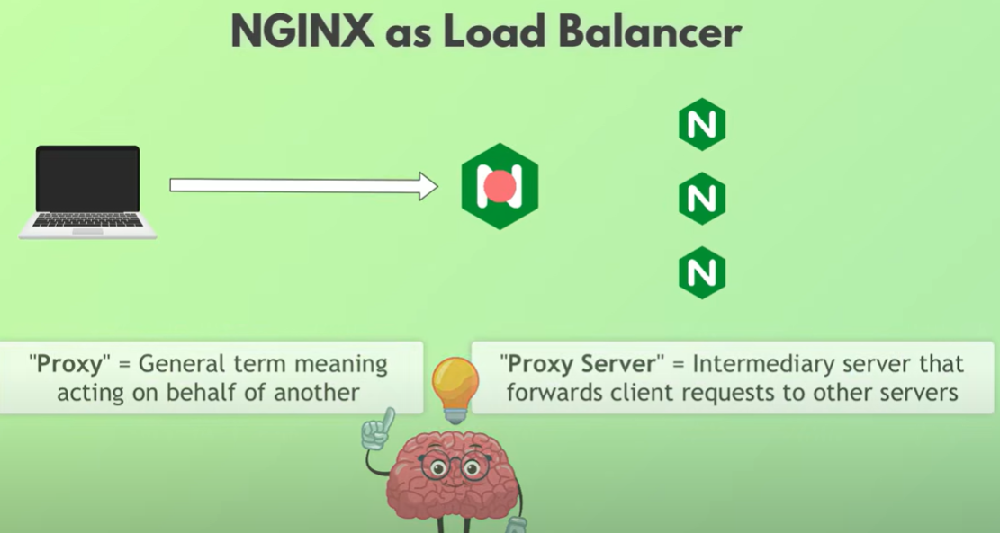

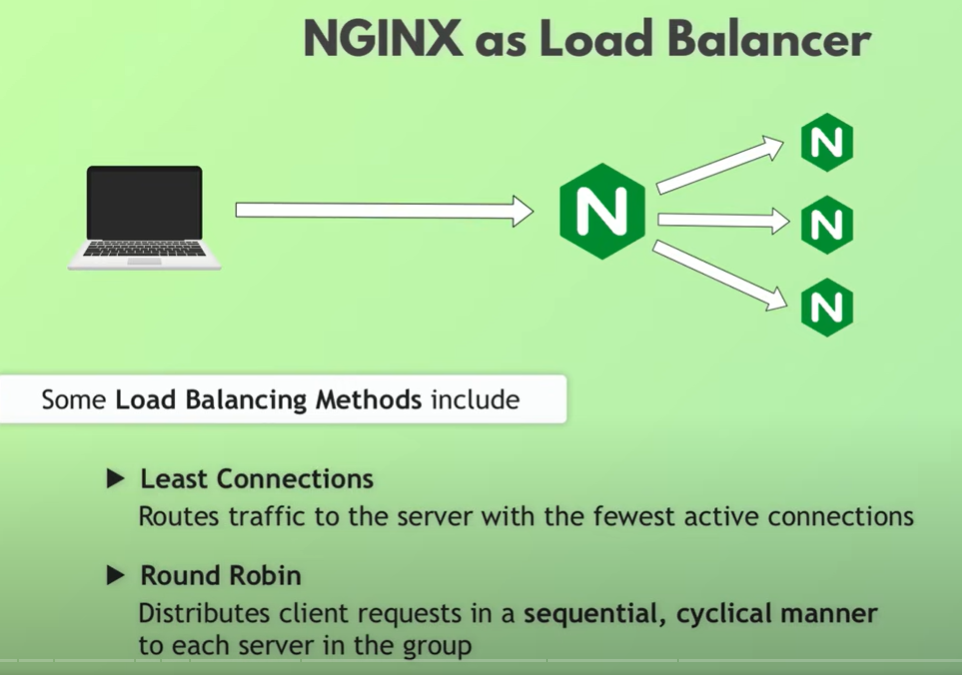

# Nginx as Cache

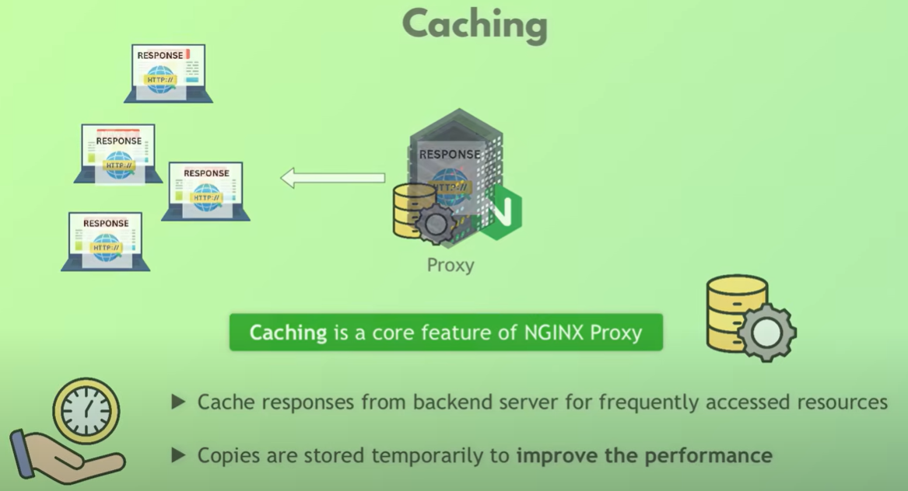

# Nginx as One Entrypoint & Security

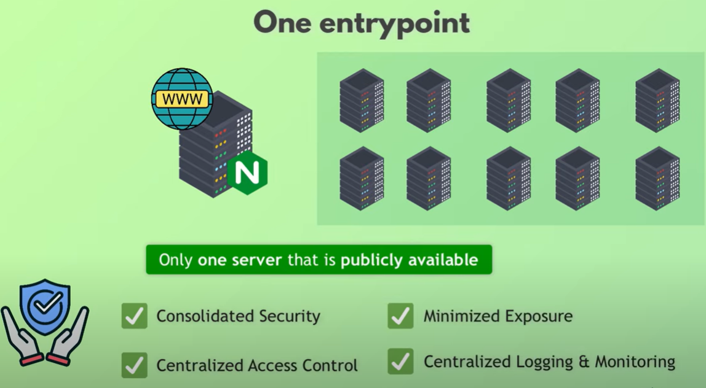

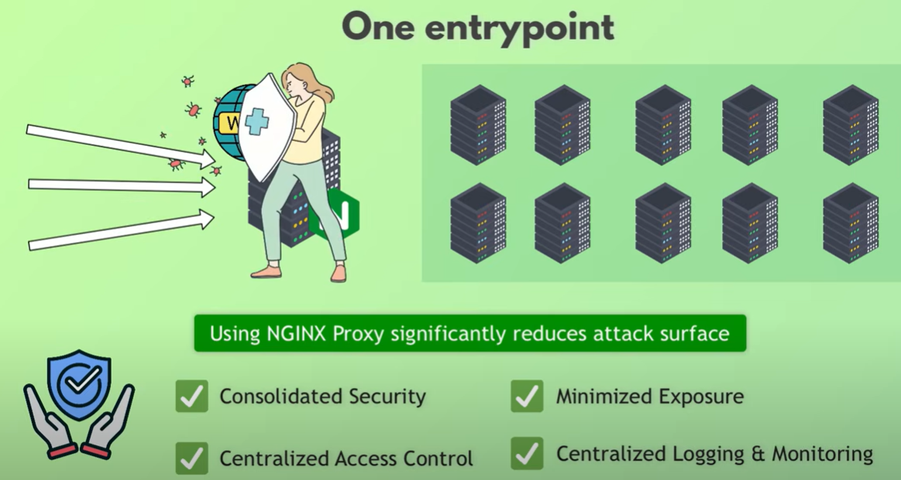

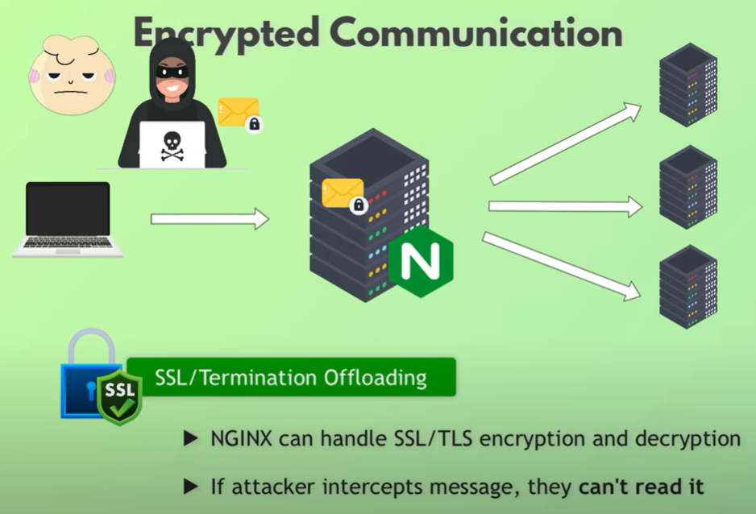

# Nginx as a compression

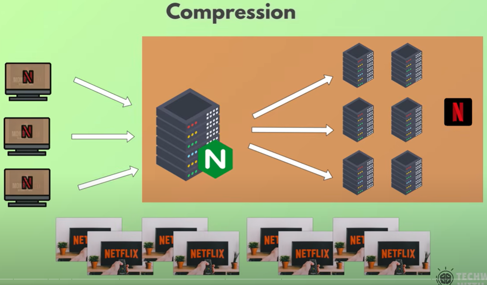

sends data as chunks (video streaming).

# Nginx in Kubernetes

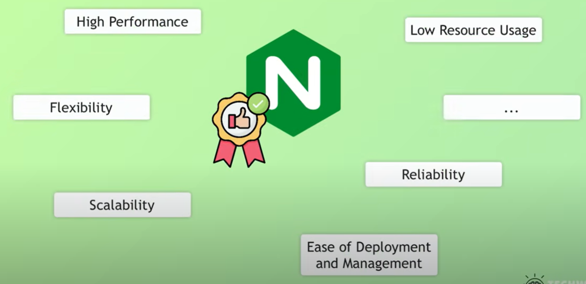
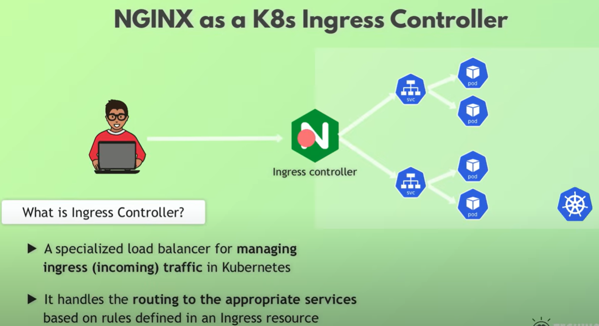

# Cloud LB and Nginx LB

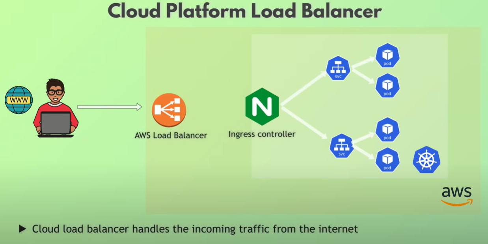

# Diff between Nginx and Apache

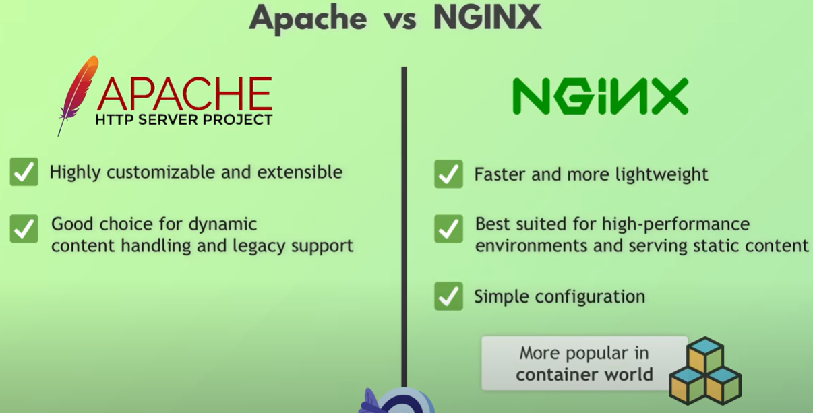

# Practicals

## step 1

Download it from gitlba and install nps.

$ cd "C:\Users\sanemu\OneDrive - Hitachi Vantara\Documents\GitHub\Cloud-DevOps-SRE\DevOps\Nginx\Youtube\nginx-crash-course-main"

HDS+sanemu@R914SKHM MINGW64 ~/OneDrive - Hitachi Vantara/Documents/GitHub/Cloud-DevOps-SRE/DevOps/Nginx/Youtube/nginx-crash-course-main (main)
$ npm install

added 69 packages, and audited 70 packages in 3s

13 packages are looking for funding
run `npm fund` for details

2 low severity vulnerabilities

To address all issues, run:
npm audit fix

Run `npm audit` for details.

HDS+sanemu@R914SKHM MINGW64 ~/OneDrive - Hitachi Vantara/Documents/GitHub/Cloud-DevOps-SRE/DevOps/Nginx/Youtube/nginx-crash-course-main (main)

---> do it on gcp-poc
[root@esb-poc-instance-1 nginx-crash-course-main]# npm install

up to date, audited 70 packages in 654ms

13 packages are looking for funding
run `npm fund` for details

2 low severity vulnerabilities

To address all issues, run:
npm audit fix

$

## step 2

$ node server.js
undefined is listening on port 3000
Request served by undefined
Request served by undefined

--> no gcp poc

## step 3

http://localhost:3000/
Below one is from GCP server, first connect to VPN and then perform
http://10.225.4.210:4000/

## step 4

Build container image (change port to 4000)
docker build ..
docker run
test it via Browser.

[root@esb-poc-instance-1 nginx-crash-course-main]# docker --version
Docker version 25.0.3, build 4debf41
[root@esb-poc-instance-1 nginx-crash-course-main]#

[root@esb-poc-instance-1 nginx-crash-course-main]# docker build -t myapp:1.0 .
[+] Building 8.5s (4/11)                                                                                                                                                      docker:default
=> [internal] load build definition from Dockerfile                                                                                                                                    0.0s
=> => transferring dockerfile: 260B                                                                                                                                                    0.0s

[root@esb-poc-instance-1 nginx-crash-course-main]# docker images
REPOSITORY   TAG       IMAGE ID       CREATED          SIZE
myapp        1.0       ec3a00f49311   11 seconds ago   918MB
[root@esb-poc-instance-1 nginx-crash-course-main]#

[root@esb-poc-instance-1 nginx-crash-course-main]# docker run -p 4000:4000 myapp:1.0
docker: Error response from daemon: driver failed programming external connectivity on endpoint hungry_wiles (6502acc70f5dee008aa31dde57e72f9ac53a4fb3f45f840906f7ba4cc5366686): Error starting userland proxy: listen tcp4 0.0.0.0:4000: bind: address already in use.
ERRO[0000] error waiting for container: context canceled
[root@esb-poc-instance-1 nginx-crash-course-main]# docker run -p 4000:4000 myapp:1.0
undefined is listening on port 4000

## step 5

docker compose
[root@esb-poc-instance-1 nginx-crash-course-main]# docker-compose up --build -d
WARN[0000] /root/sws/nginx-crash-course-main/docker-compose.yaml: the attribute `version` is obsolete, it will be ignored,                                                                    please remove it to avoid potential confusion
[+] Building 0.3s (23/33)                                                                                  docker:default
=> [app3 internal] load build definition from Dockerfile                                                            0.0s
=> => transferring dockerfile: 260B                                                                                 0.0s
=> [app1 internal] load build definition from Dockerfile                                                            0.0s

[root@esb-poc-instance-1 nginx-crash-course-main]# docker ps
CONTAINER ID   IMAGE                          COMMAND                  CREATED          STATUS          PORTS                                       NAMES
7e9470f84b16   nginx-crash-course-main-app1   "docker-entrypoint.s…"   28 seconds ago   Up 27 seconds   0.0.0.0:4001->4000/tcp, :::4001->4000/tcp   nginx-crash-course-main-app1-1
25007b8e7aa4   nginx-crash-course-main-app3   "docker-entrypoint.s…"   28 seconds ago   Up 27 seconds   0.0.0.0:4003->4000/tcp, :::4003->4000/tcp   nginx-crash-course-main-app3-1
718f16bd79f6   nginx-crash-course-main-app2   "docker-entrypoint.s…"   28 seconds ago   Up 27 seconds   0.0.0.0:4002->4000/tcp, :::4002->4000/tcp   nginx-crash-course-main-app2-1
[root@esb-poc-instance-1 nginx-crash-course-main]#

[+] Running 4/4
✔ Network nginx-crash-course-main_default   Created                                                                 0.2s
✔ Container nginx-crash-course-main-app2-1  Started                                                                 0.7s
✔ Container nginx-crash-course-main-app3-1  Started                                                                 0.6s
✔ Container nginx-crash-course-main-app1-1  Started                                                                 0.7s
[root@esb-poc-instance-1 nginx-crash-course-main]# docker ps
CONTAINER ID   IMAGE                          COMMAND                  CREATED          STATUS          PORTS                                       NAMES
7e9470f84b16   nginx-crash-course-main-app1   "docker-entrypoint.s…"   28 seconds ago   Up 27 seconds   0.0.0.0:4001->4000/tcp, :::4001->4000/tcp   nginx-crash-course-main-app1-1
25007b8e7aa4   nginx-crash-course-main-app3   "docker-entrypoint.s…"   28 seconds ago   Up 27 seconds   0.0.0.0:4003->4000/tcp, :::4003->4000/tcp   nginx-crash-course-main-app3-1
718f16bd79f6   nginx-crash-course-main-app2   "docker-entrypoint.s…"   28 seconds ago   Up 27 seconds   0.0.0.0:4002->4000/tcp, :::4002->4000/tcp   nginx-crash-course-main-app2-1
[root@esb-poc-instance-1 nginx-crash-course-main]#

### Test it

http://10.225.4.210:4001/
http://10.225.4.210:4002/
http://10.225.4.210:4003/

## Step 6

Install nginx on poc
path of the config file : /etc/nginx/nginx.conf

### Updating the above conf file.

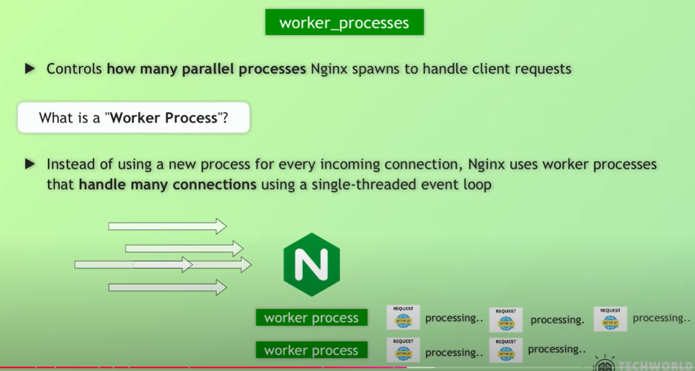
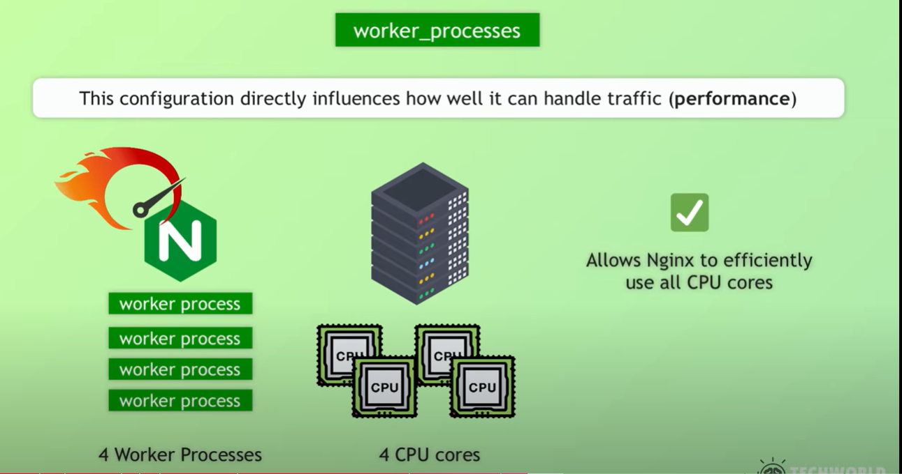
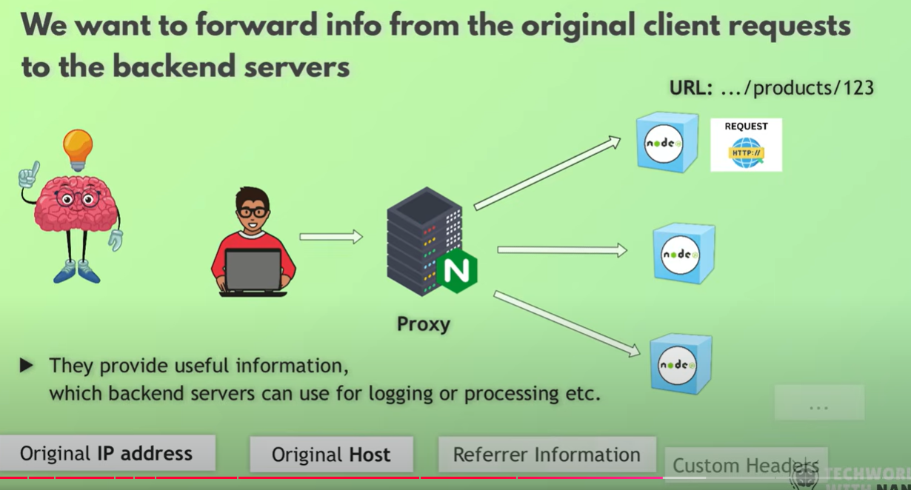
