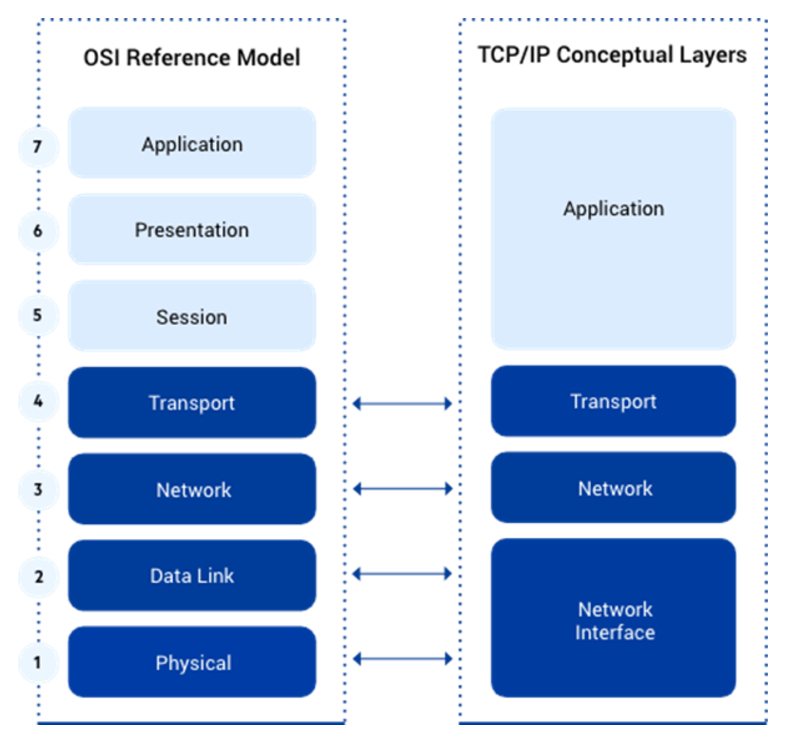

js

# Commands

## Linux

getenforce

setenforce 0

ssh-keygen -R `<ip> --> it will update known_hosts file with the appropriate ip address. `

apt-get install build-essential

### OSI-Open System Interconnection

### hashing

base64

md5sum `<file>`

### Curl

#### Download a file

curl https://upload.wikimedia.org/wikipedia/commons/thumb/a/a4/Ada_Lovelace_portrait.jpg/800px-Ada_Lovelace_portrait.jpg --output ada.jpg

## Network

### netstat

netstat -an | grep `<port>`

netstat -ntlp

### tcpdump

tcpdump -A -i eth1 'port 80'

### ab - apache bench

yum -y install httpd-tools

it has ab tools, which is helpful to test load balancer

ab -n 500 localhost/  ---------> this command will send 500 requests to the load balancer

ab : apache bench

ab -n 20 -c `<port>:80`
